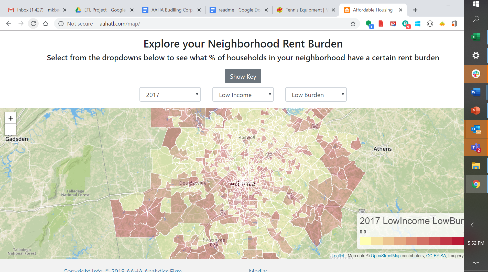

**AAHA Final Project Proposal**

In this final iteration, the Achieving Affordable Housing in Atlanta team (AAHA) has decided that we can no longer be a passive observer to the problem of affordable housing in Metro Atlanta.  We have analyzed a lot of data and have some great ideas of how to solve the problem  It is time for us to take action!  

We have decided to become the AAHA Building Corp, bringing to reality needed housing for the people in our city where they need it, with the features they need, at a price they can afford.  In order to create proposals to submit to the City of Atlanta and other area housing authorities, the AAHA team is creating a machine learning application to predict what the fair market rent should be anywhere in the metro Atlanta area.  We will then analyze the area median income(AMI) for that census tract and have proposed rent at no more than 50% of the AMI for that census tract.  We can then identify how much of a subsidy is needed for that development so that we can submit the affordable housing plan to the proper agencies for review.   Since this will give us, as a builder, a very reliable and informative tool for where and what to build, we also want to share our model with the public so that more affordable housing can be built to finally improve the housing crisis in our hometowns.

How will we accomplish this?  We will utilize the xgboost machine learning model, which is a  supervised model,  to analyze the National Low Income Housing Preservation data set to predict within a $75 error for what the fair market rent should be anywhere within the Atlanta area.  

The team will use this as an input to other models where we will look at the area median income and whether there is a gap.  We will calculate what the needed subsidy would be in order for AAHA Building Corp to actually build housing that is affordable in that area.  Other unsupervised modeling may elicit additional correlations to visualize and segments to target.

Our website will provide an interactive calculator to present this  data that could be used by others to analyze an area for this same analysis.  There will be data regarding the property itself, and an analysis for the income brackets vs. rent burden.

The AAHA Building Corp is excited to bring you this website and the analytics engine for use by everyone.  With this information, we all can truly understand the financial costs that exist to make affordable housing a reality.  We can now pinpoint how to overcome the very real objections to building this housing vs. the previous "it’s the right thing to do" argument that quite frankly wasn’t working for anyone. 

Let’s dive a bit deeper into what the site offers:

Our landing page, [www.aahatl.com](www.aahatl.com),  give you several navigation menus to begin to understand the problem.  Use the top menu option to get to a specific page or click on a visualization to get to a story/visualization that interests you.

We can go to an interactive teams page that is a lot of fun!  You will be able to see our group of talented developers and analysts in action.  Click on each team members name to learn the following:

* What they do for their day job

* Why they care about this project

* Fun fact(s) you would probably never guess about them

Next we move into a progression of data visualizations to tell the story from start to finish about the nature and scope of the problem.  Let’s start with the data.  We worked with the latest census data, American Community Survey, and the National Low Income Housing Preservation data sets.  We scraped them, cleaned them, did ETL on them, and formatted the data sets for analysis.  Complete details of these activities can be found [here](https://drive.google.com/drive/u/0/folders/1HhD_gNlLlDaVNJZR9BizpSb3LnXUH8w7).  

Once the data was cleansed, we created several visualizations in Tableau.  We published these visualizations to Tableau Public.  We used a java script api to embed the Tableau visualization into our website consumable via the Data Stories menu.

We also built an interactive visualization that used geojsons and D3 to show my year, income bracket, and degree of rent burden anywhere in the Metro ATL region.

This brings us to the final phase of the web site which went live as [www.aahatl.com/tool](www.aahatl.com/tool).

 We created a machine learning model based on Random Forests which was used to predict within $75 the Fair Market Rent (FMR) for any location in the metro Atlanta area.  The code for creating the ML model can be viewed at [www.aahatl.com/ML](www.aahatl.com/ML). 

The AAHA team took this output and created an interactive gauge of what affordable rent for that census tract is vs. the FMR.  For areas experiencing gentrification, expect to see the gauge show a significant red portion (how much above affordable the FMR is) which will tell you the gap between what rent is being charged vs what people can actually comfortably pay.  

This gap is the amount of subsidy per unit that a builder would need to receive in order to build units for affordability and not compromise profit.  This in aggregate is the info that a builder would need in order to propose to build and be net neutral.  This gives us a view into the entire cost to the Metro Atlanta area of how much public investment must be made to achieve affordable housing for everyone.

We also pulled in street and map views from Google about the address and provide a breakout of the income brackets and rent burden for the census tract.

The team then did analysis and identified three proposed affordable housing projects that we feel should be pursued.  The proposed site pages give you a tangible view of how a proposal could come together to be presented to the area’s housing authority.

Each page has a Google street view at the top to show you the property location.  We pull in the info from our ML tool to give affordable rent vs. FMR and give data points on the location.  We then show a street view of the property so you can explore nearby amenities.  The team provide local housing authority contact information, access to public transportation, school info, amenities, and crime data for the area.

We then embedded a Tableau story that had pulled data for [Atlanta Statistics](http://statisticalatlas.com/) to give a breakout of the area by income, employment type, education levels, and more to give more context to the area.  Each page has data specific to the proposed location.

Our develop notes can be found [here](https://docs.google.com/document/d/1LHlZr4NY2PQUCGCWb017QfirztOb8pnJ5i7DZHfRHB4/edit?usp=sharing).  Screen shot of json 

Please contact us if you have comments or suggestions for improvement.

 

